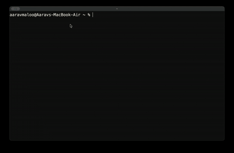

<h1 align="center">blob: minimal note manager</h1>

<p align="center">
  
  
  
  
</p>

<p align="center">
  
</p>


`blob` is a minimalistic and efficient inline terminal note manager that stays out of your way. It is programmed in C and keeps the interface small, fast, and terminal-native.

## Features
- inline interactive note selector
- markdown note creation
- live note search
- rename, trash, and restore flows (permanent deletion only happens from the trash bin)
- interactive trash bin viewer (`t`) — browse, restore, or purge trashed notes
- command palette for core actions and installed plugins
- favorites / starred notes (`*`) — float favourite notes to the top
- config file (`~/.local/share/blob/config`) — persistent editor, theme, and sort settings
- 21 built-in themes — dark and light versions of Catppuccin, Tokyo Night, Gruvbox, Rosé Pine, Dracula, Solarized, Everforest, Kanagawa and One, plus Nord, `default` and `mono`, with 24-bit colour and a live preview
- relative timestamps and pagination
- safer plugin installs with API, mode, and permission metadata
- multi-level undo (`u`) and redo (`Ctrl+Z`) — undo up to 10 previous trash/rename actions
- configurable sorting — `sort = mtime|title|size` with `Ctrl+T` cycling and reverse support
- trash auto-purge (`purge_days`) — trashed notes older than N days are cleaned up on startup
- `blob doctor` — run `blob doctor` (or `:doctor`) for a self-check of dirs, config, and plugins
- session restore — re-selects the last opened note on launch
- quick view (`v`) — read a note inline without opening your editor
- vim-style navigation — `g`/`G` top/bottom, `PgUp`/`PgDn` page, `Ctrl+U`/`Ctrl+D` half-page
- customizability

## Customizing blob

Press `,` (or run `:settings`) to open the settings panel. `Tab` / `Shift+Tab` switch between the **general**, **display**, **notes**, **plugins** and **keys** sections, `↑/↓` move, `←/→` change a value and `Enter` edits text values. Every change is saved to the config file immediately.

blob reads `~/.local/share/blob/config` on startup. The config file uses a simple `key = value` format:

```
editor = nvim
theme = dracula
sort = mtime
```

| Setting  | Description |
|----------|-------------|
| `editor` | Overrides `$EDITOR` (default: `vim` on macOS/Linux, `notepad` on Windows) |
| `theme`  | Color preset, see [Themes](#themes). `dark`, `light` and `solarized` still work as aliases |
| `colors` | `auto` (24-bit when the terminal supports it), `truecolor`, or `256` |
| `sort`   | Sort order: `mtime` (newest first), `title` (alphabetical), `size` |
| `sort_reverse` | `true`/`false` — reverse the sort direction (favorites still float to top) |
| `purge_days` | Auto-delete trashed notes older than this many days (`0` disables) |
| `key_view` | Keybind for quick view mode (default: `v`) |
| `restore_session` | `true`/`false` — reselect the last opened note on startup (default `true`) |
| `visible_notes` | Notes shown before the list scrolls, `3`–`50` (default `12`) |
| `date_style` | `relative` (`3h ago`) or `absolute` (`Oct 03 14:20`) |
| `show_hints` | `true`/`false` — show the shortcut line under the list |
| `confirm_trash` | `true`/`false` — ask before moving a note to the trash (default `true`) |
| `open_after_create` | `true`/`false` — open the editor right after creating a note (default `true`) |
| `plugin_source` | `local` (installed and `./addons` only), `ask` (ask before contacting GitHub, default) or `github` (always check GitHub) |
| `plugin_confirm_run` | `true`/`false` — show permissions and ask before running a plugin (default `true`) |
| `plugin_confirm_install` | `true`/`false` — show permissions and ask before installing or updating a plugin (default `true`) |
| `plugin_scan_cwd` | `true`/`false` — also list plugins from `./addons` in the current folder (default `true`) |
| `plugin_repo` | GitHub `owner/name` plugins are downloaded from (default `aaravmaloo/blob`) |
| `plugin_branch` | Branch plugins are downloaded from (default `master`) |

You can also set the editor via the `EDITOR` environment variable — the config file takes precedence.

## Themes

Change the theme from settings (`,` → general → theme, colours change as you press `←/→`) or with the `themes` plugin (`c`), which shows a live preview.

| Dark | Light |
|------|-------|
| `catppuccin-mocha` | `catppuccin-latte` |
| `tokyo-night` | `tokyo-night-day` |
| `gruvbox-dark` | `gruvbox-light` |
| `rose-pine` | `rose-pine-dawn` |
| `dracula` | `alucard` |
| `solarized-dark` | `solarized-light` |
| `everforest` | `everforest-light` |
| `kanagawa` | `kanagawa-lotus` |
| `one-dark` | `one-light` |
| `nord` | |

`default` uses your terminal's own colour palette and `mono` uses no colour at all. Named themes use exact 24-bit colours on terminals that support them (kitty, iTerm2, WezTerm, Ghostty, Alacritty, Windows Terminal, VS Code) and the nearest 256-colour match elsewhere, such as Apple Terminal. Set `colors = 256` if a theme looks wrong. Pick a dark theme for a dark terminal background and a light theme for a light one.

## Installation
blob can be installed via yay, brew, winget, [github releases](https://github.com/aaravmaloo/blob/releases), or can be compiled from scratch.

To install it using Homebrew (macOS / Linux), use the following commands.
```sh
brew tap aaravmaloo/tap
brew install blob
```
and you will be good to go!

To install it using yay (arch linux), use the following command.
`yay -S blob-bin`
and you will be good to go!

To install it using winget run the following command.
`winget install aaravmaloo.blob`
and you will be good to go!

To compile from scratch, use the following steps.
clone:

`git clone https://github.com/aaravmaloo/blob`

change dir:

`cd blob`

compile:

```sh
make
```

Or for an optimized release build:

```sh
make release
```

*Note: On Windows, you may need to use `mingw32-make` instead of `make` depending on your environment.*

## Keybindings

| Key | Action |
|-----|--------|
| `↑/↓` | Navigate notes |
| `Enter` | Open note |
| `n` | Create note |
| `r` | Rename note |
| `d` | Move note to trash |
| `t` | Open trash bin (restore or permanently delete trashed notes) |
| `y` | Copy note path |
| `*` | Star / unstar note (floats to top) |
| `/` | Search notes |
| `:` | Open command palette |
| `p` | Open plugins manager |
| `,` | Open settings |
| `v` | Quick view note (read inline, `e` to edit) |
| `g` / `G` | Jump to first / last note |
| `PgUp` / `PgDn` | Scroll a full page |
| `Ctrl+U` / `Ctrl+D` | Scroll half a page |
| `Ctrl+T` | Cycle sort order (mtime → title → size) |
| `Ctrl+Z` | Redo |
| `Ctrl+R` | Show reminders |
| `?` / `Ctrl+O` | Show all keybindings |
| `Esc` | Clear search |
| `q` | Quit |

## Plugins

blob supports optional, compiled plugins to extend its features (like encryption or sync) without bloating the core. Press `p` inside the interface to manage plugins. For every step/access blob does, it requires your permission for maximum safety.

Plugins declare an API version, run mode, and permissions in their README manifest. blob warns about legacy plugins, keybind conflicts, and plugins that require a newer API.

### Built-in plugins

| Plugin | Key | What it does |
|--------|-----|--------------|
| `lock` | — | Encrypt/decrypt notes with a password |
| `stats` | `s` | Show character, word, and line counts |
| `archive` | `a` | Move notes to an archive folder |
| `git-sync` | `g` | Commit and push notes to a git repo |
| `pin` | `i` | Pin/unpin notes (floated to top with prefix) |
| `fuzzy-search` | `f` | Fuzzy search across note titles and content |
| `tags` | `z` | Read, add, and clear tags metadata |
| `word-count` | `w` | Words, chars, lines, sentences, reading time |
| `open-dir` | `o` | Open the note's folder in your file explorer |
| `export` | `e` | Export to HTML, PDF, or DOCX via pandoc |
| `remind` | `m` | Set a timed system notification for a note |
| `themes` | `c` | Pick one of the 21 built-in themes with a live preview |

If you are a developer and want to create your own plugin, see [PLUGIN_DEVELOPMENT.md](PLUGIN_DEVELOPMENT.md).

## Storage

blob stores notes in:

Linux:
```text
~/.local/share/blob/notes
```

macOS:
```text
~/Library/Application Support/blob/notes
```

Windows:
```text
%LOCALAPPDATA%\blob\notes
```

## Diagnostics

If something isn't working, run the built-in self-check:

```sh
blob doctor
```

It verifies your data dir, notes dir, config file, favorites, plugin keybind overrides, plugin compilation state, plugin system, and session file. Missing dirs or un-compiled plugins are reported with `[!!]` and the command exits non-zero. You can also run it from inside the TUI with the `:doctor` command palette entry.

## Philosophy

blob is designed to be:
- minimal
- keyboard-driven
- fast
- dependency-free
- an inline selector, not a fullscreen TUI
